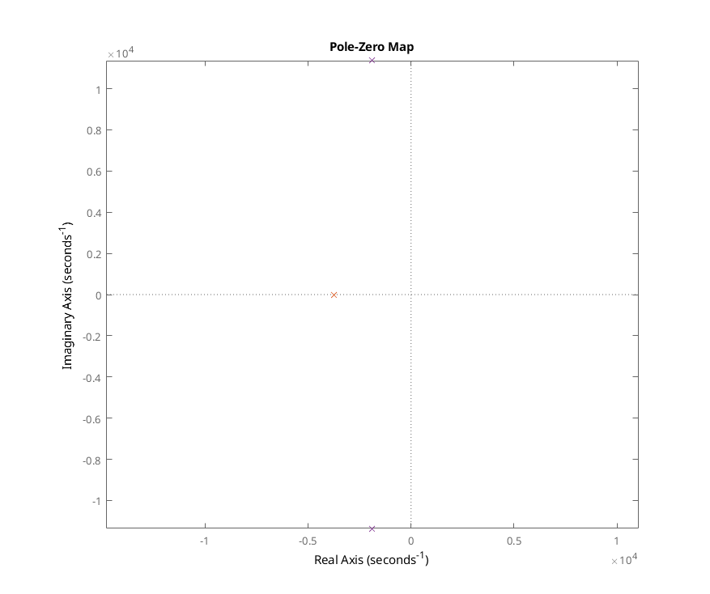
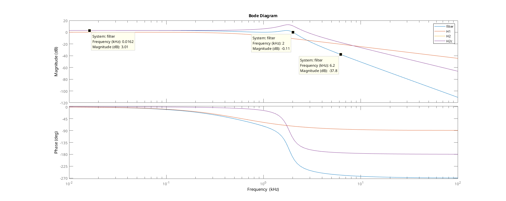
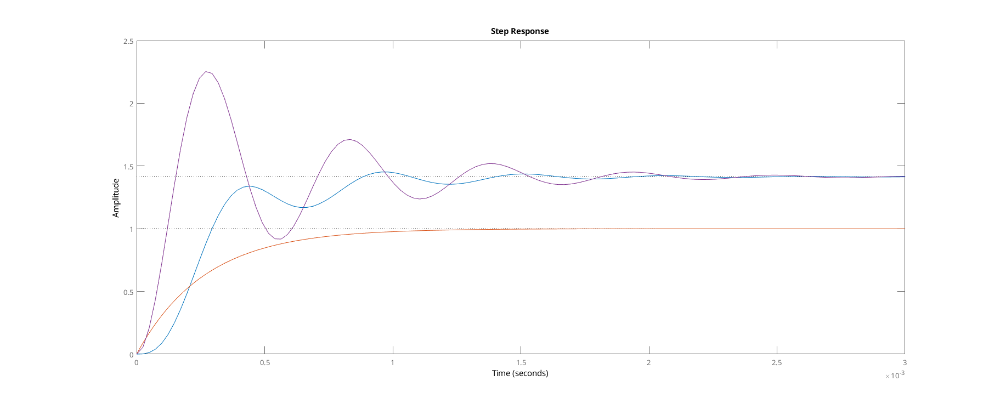
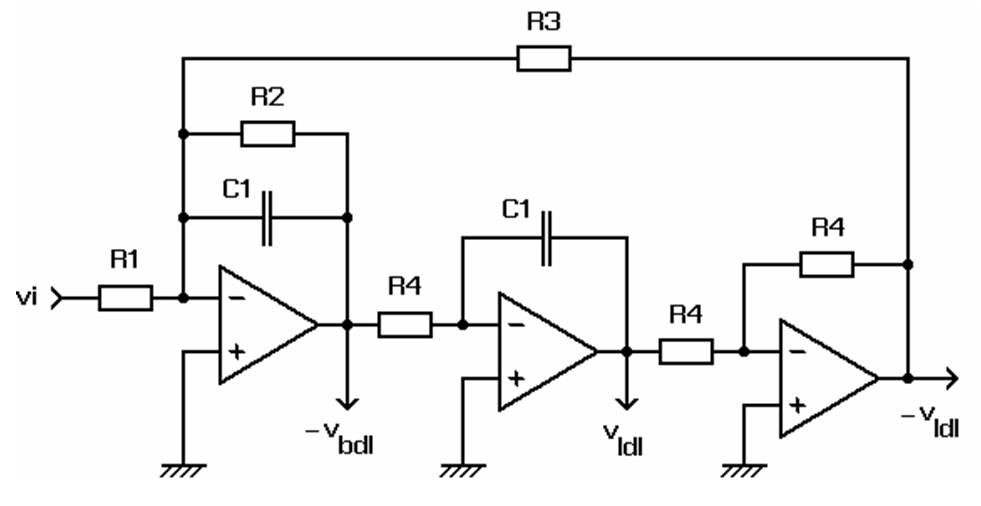
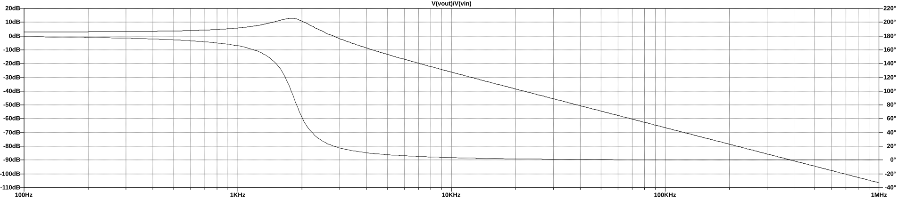
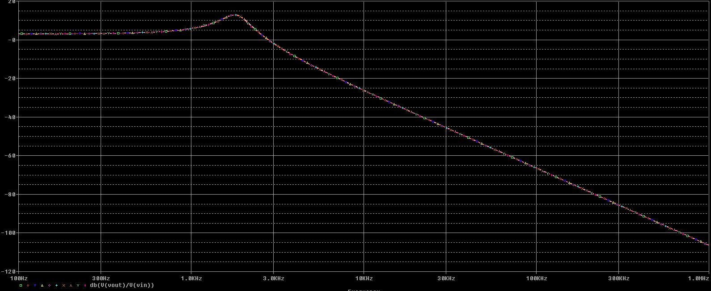
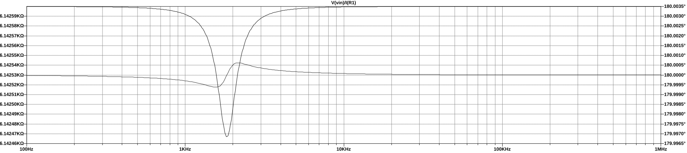
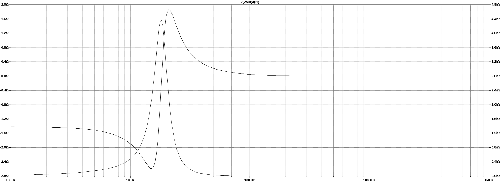
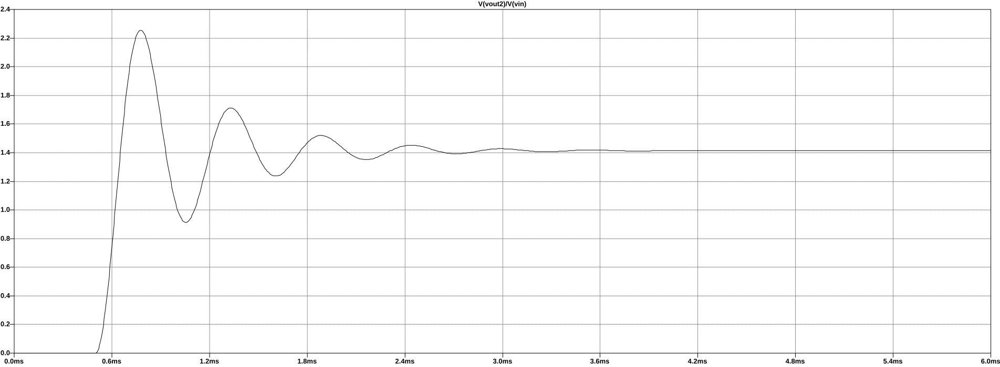

# Opdracht S2: Chebyshev filter

## Specificatie

+ Type: Chebyshev
+ $|H(0)| = 3dB$
+ $A_p = 3dB$
+ $A_s = 40dB$
+ $f_c = 2kHz$
+ $f_s = 6,2kHz$

## Synthese & Analyse (MATLAB)

\lstinputlisting[language=Matlab]{AFCheb.m}

### Pole Zero plot

{height=450px}

### Bode plot

{height=350px}

### Stapresponsie

{height=350px}

## Synthese 2e actieve filtertrap Biquad

{height=250px}

$$H(s) = \frac{\frac{R3}{R1}\frac{1}{R3 \cdot R4 \cdot C1^2}}{s^2 + s(\frac{1}{R2 \cdot C1}) + \frac{1}{R3 \cdot R4 \cdot C1^2 }}$$

### Ontwerpvergelijkingen

Staan in cursus Signaalverwerking, pagina CMT17-CMT18.

$C1 = 1$

$R1 = \frac{1}{K\omega_n}$

$R2 = \frac{Q}{\omega_n}$

$R3 = R4 = R = \frac{1}{\omega_n}$

MATLAB code staat bij in het eerste deel, samen met de uitkomesten van de bewerkingen.

## SPICE

Dit is (zoals in de opgave) enkel de 2^e^ orde trap!

### Netlist

\lstinputlisting{bode.cir}

### Bode plot

{height=250px}

Dit is vrijwel identiek aan de Matlab 

### Monte Carlo analyse

{height=250px}

Hier is bijna geen verschil. (Met 1% R en C.) 

### Ingangsimpedantie

{height=250px}

Er is bijna geen variatie in de ingangsimpedantie.

### Uitgangsimpedantie

{height=250px}

### Staprespontie

{height=250px}

