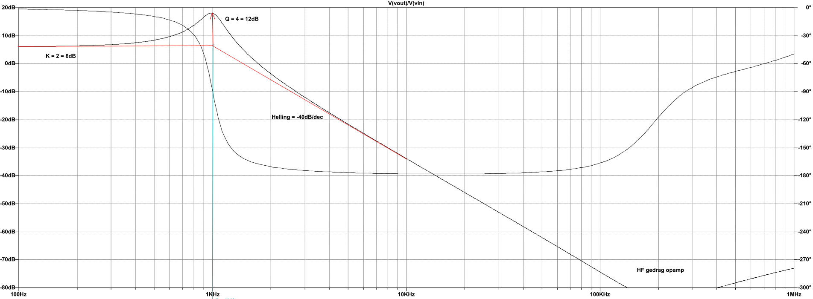

# Opdracht 2A: Analyse v.e. actieve filtertrap

## Specificatie

{height=150px}

+ **Low Pass KHN - Non Inverting** (schema nr 5)
+ Filter is een *LDL*
  + $|H(0)| = 6dB$
  + $|H(10 kHz)| = -34dB$
  + $Q_p = 4$

## Analyse

### 1. Bepaal de DC- en HF-weergave

#### DC

Bij DC zijn condensatoren open kring, dus wordt de versterking bepaald door de feedback weerstanden $R_4$, $R_5$, en $R_6$. Dit is dus een vaste versterking. $|H(DC)| = A$.

{height=150px}

#### HF

Bij HF ($f=\infty$) zijn de condensatoren kortsluitingen, dus wordt het signaal volledig onderdrukt door de feedback lussen $C_1$ en $C_2$. $|H(HF)| = -\infty dB$

{height=150px}

### 2. Bepaal de transferfunctie

Ik heb de transfer functie uitgerekend door het schema op te splitsen in twee integrators en de eerste opamp.

#### De integrators

{height=150px}

De algemene formule voor een integrator is $v_o=\frac{-v_1}{sRC}$.
Voor deze twee specifieke gevallen: $v_5=\frac{-v_4}{sR_1C_1}$ en $v_{out} = \frac{-v_5}{sR_2C_2}$.
Gecombineerd: $v_{out}=\frac{v_4}{s^2R_1C_1R_2C_2}$ of $v_4 = s^2R_1R_2C_1C_2v_{out}$

#### Superpositie

##### Geval 1: $v_{in}$, $v_{out} = v_5 = 0$

{height=150px}

De opamp is nu een niet inverterende versterker. 
$v_4 = v_1 \cdot (1+\frac{R_6}{R_5})$
$v_1 = v_{in} \cdot \frac{R_4}{R_3+R_4} \Rightarrow v_4 = v_{in} \cdot \frac{R_4}{R_3+R_4} \cdot (1+\frac{R_6}{R_5}) = v_{in} \cdot \frac{R_4}{R_3+R_4} \cdot \frac{R_6+R_5}{R_5}$

##### Geval 2: $v_5$, $v_{out} = v_{in} = 0$

{height=150px}

De opamp is nu een niet inverterende versterker.

$v_4 = v_1 \cdot (1+\frac{R_6}{R_5})$
$v_1 = v_5 \cdot \frac{R_3}{R_3+R_4} \Rightarrow v_4 = v_5 \cdot \frac{R_3}{R_3+R_4} \cdot (1+\frac{R_6}{R_5}) = v_5 \cdot \frac{R_3}{R_3+R_4} \cdot \frac{R_6+R_5}{R_5}$

##### Geval 3: $v_{out}$, $v_5 = v_{in} = 0$

{height=150px}

De opamp is nu een inverterende versterker.

$v_4 = \frac{-R_6}{R5} \cdot v_{out}$

#### Totaal

$v_4 = \sum{v_4} = v_{in} \cdot \frac{R_4}{R_3+R_4} \cdot \frac{R_6+R_5}{R_5} + v_5 \cdot \frac{R_3}{R_3+R_4} \cdot \frac{R_6+R_5}{R_5} + \frac{-R_6}{R5} \cdot v_{out}$

$v_{in} \cdot \frac{R_4}{R_3+R_4} \cdot \frac{R_6+R_5}{R_5} = -v_5 \cdot \frac{R_3}{R_3+R_4} \cdot \frac{R_6+R_5}{R_5} + \frac{R_6}{R5} \cdot v_{out} + v_4$

Vervang in deze formule $v_5$ en $v_4$ door de formules van de twee integrators:

$v_{in} \cdot \frac{R_4}{R_3+R_4} \cdot \frac{R_6+R_5}{R_5} = v_{out} \cdot (sR_2C_2 \cdot \frac{R_3}{R_3+R_4} \cdot \frac{R_6+R_5}{R_5} + \frac{R_6}{R5} + s^2R_1R_2C_1C_2v)$

$\frac{v_{in}}{v_{out}} \cdot \frac{R_4}{R_3+R_4} \cdot \frac{R_6+R_5}{R_5} = s^2R_1R_2C_1C_2 + sR_2C_2 \cdot \frac{R_3}{R_3+R_4} \cdot \frac{R_6+R_5}{R_5} + \frac{R_6}{R5}$

$\frac{v_{out}}{v_{in}} = \frac{R_4}{R_3+R_4} \cdot \frac{R_6+R_5}{R_5} \cdot \frac{1}{s^2R_1R_2C_1C_2 + sR_2C_2 \cdot \frac{R_3}{R_3+R_4} \cdot \frac{R_6+R_5}{R_5} + \frac{R_6}{R5}}$

$\frac{v_{out}}{v_{in}} = \frac{R_4}{R_3+R_4} \cdot \frac{R_6+R_5}{R_5} \cdot \frac{1}{\frac{R_6}{R5} \cdot (s^2 \cdot \frac{R_1R_2C_1C_2R_5}{R_6} + sR_2C_2 \cdot \frac{R_3}{R_3+R_4} \cdot \frac{R_6+R_5}{R_6} + 1)}$

**Het resultaat:** $H(s) = \frac{v_{out}}{v_{in}} = \frac{R_4}{R_3+R_4} \cdot \frac{R_6+R_5}{R_6} \cdot \frac{1}{s^2 \cdot \frac{R_1R_2C_1C_2R_5}{R_6} + sR_2C_2 \cdot \frac{R_3}{R_3+R_4} \cdot \frac{R_6+R_5}{R_6} + 1}$

### 3. Vergelijk transfer functie met de algemene

Algemene vorm LDL filter: $H(s) = K\frac{1}{(\frac{s}{\omega_n})^2+\frac{1}{Q}\cdot(\frac{s}{\omega_n})+1}$

+ $K=\frac{R_4}{R_3+R_4} \cdot \frac{R_5+R_6}{R_6}$
+ $\frac{1}{\omega_n^2} = \frac{C_1C_2R_1R_2R_5}{R_6}$
+ $\frac{1}{Q\omega_n}=C_2R_2 \cdot \frac{R_3}{R_4+R_3} \cdot \frac{R_5+R_6}{R_6}$

### 4. Pole-zero plot

+ Geen zeros
+ Wel polen, namelijk:

$\frac{s^2}{\omega_n^2} + \frac{s}{Q\omega_n} + 1 = 0$

$\frac{s^2}{(2000\pi)^2} + \frac{s}{4\cdot2000\pi} + 1 = 0$

$\frac{s^2}{(2000\pi)^2} + \frac{s}{8000\pi} + 1 = 0$

2 complexe polen:

$250\pi(-1+3\sqrt{7}i)$ en $250\pi(-1-3\sqrt{7}i)$

of ongeveer

$-785+6234i = 6283 \angle \ang{97}$ en $-785-6234i = 6283 \angle \ang{-97}$

\begin{center}
\begin{tikzpicture}
\begin{axis}[
title={Pole-Zero Plot},
axis x line=center,
axis y line=center,
yticklabels={,,},
xticklabels={,,},
xlabel=$\Re$,
ylabel=$\Im$,
xmin=-6300,
xmax=6300,
ymin=-6300,
ymax=6300,
axis equal image
]
\addplot[
only marks,
mark=x,
mark size=5pt,
] coordinates {(-785,-6234) (-785,+6234)};
\draw [dashed] (axis cs:0,0) circle [radius=6283];
\end{axis}
\end{tikzpicture}
\end{center}

### 5. Frequentiegedrag

\begin{tikzpicture}
\begin{axis}[
width=\textwidth,
height=\axisdefaultheight,
title={Asymptotisch Bodediagram},
xlabel={Frequentie [Hz]},
ylabel={Versterking [dB]},
xmode=log,
ymajorgrids=true,
xmajorgrids=true, 
xminorgrids=true,
grid style=dashed,
xmin=100, xmax=10000,
ymin=-40, ymax=20,
ytick={0,6,-34},
]

\addplot
table {
100 6
1000 6
10000 -34
};
\node[color=blue] at (axis cs: 2000,-15) {$-40dB/dec$};
\node[color=blue,anchor=south] at (axis cs: 200,6) {$K = 2 = 6dB$};
\draw[thick,red,->] (axis cs: 1000,6) -- (axis cs: 1000,15);
\node[color=red,anchor=west] at (axis cs: 1000,10) {$Q = 4$};

\end{axis}
\end{tikzpicture}

De lijn van $-40dB/dec$, het beginpunt bij $10 kHz,-34dB$, en het filtertype (LDF) laat toe $f_n$ te berekenen. We moeten $40dB$ zakken van $6dB$ to $-34dB$, dit is dus 1 decade, ofwel $f_n = 1 kHz$.
Door de dubbele pool is er maar 1 knik in de grafiek, daar gaat de helling van $0$ naar $-40dB/dec$.

### 5. Tijdsgedrag


ToDo: Dit heel deel

ToDo: Grafiek

ToDo: Bespreek ligging polen

## Synthese

### Ontwerpvergelijkingen

Kies:
+ $C_2 = c^{te} = 1$
  Kies $C_2$ omdat van $C_1$ makkelijker een ontwerpvergelijking te vinden is.
+ $R = R_1 = R_2 = R_3 = R_4 = R_6$
  $R_5$ variabel omdat die enkel in tellers zit. Dit maakt ontwerpvergelijkingen makkelijker.

De transfer functie wordt dan:

$H(s) = \frac{R+R_5}{2R} \cdot \frac{1}{s^2RC_1C_2R_5 +  s \cdot (R+R_5) \cdot \frac{C_2}{2} + 1}$

Met de vergelijkingen van uit de transfer functie:
+ $K=\frac{R_4}{R_3+R_4} \cdot \frac{R_5+R_6}{R_6}$
+ $\frac{1}{\omega_n^2} = \frac{C_1C_2R_1R_2R_5}{R_6}$
+ $\frac{1}{Q\omega_n}=C_2R_2 \cdot \frac{R_3}{R_4+R_3} \cdot \frac{R_5+R_6}{R_6}$

Geeft:

+ $K = \frac{R}{2R} \cdot \frac{R_5+R}{R} = \frac{R_5+R}{2R} \Rightarrow R_5 + R = 2KR \Rightarrow R_5 = R(2K-1)$
+ $\frac{1}{\omega_n^2} = \frac{C_1C_2R^2R_5}{R} = C_1C_2RR_5 \Rightarrow C_1 = \frac{1}{\omega_n^2C_2R_5R}$
+ $\frac{1}{Q\omega_n}=C_2R_2 \cdot \frac{R_3}{R_4+R_3} \cdot \frac{R_5+R_6}{R_6} = C_2R \cdot \frac{R}{2R} \cdot \frac{R_5+R}{R} = \frac{C_2(R_5+R)}{2} \Rightarrow Q = \frac{2}{\omega_nC_22KR} \Rightarrow R = \frac{1}{Q\omega_nC_2K}$

De ontwerpvergelijkingen:

+ $R = \frac{1}{Q\omega_nC_2K}$
+ $R_5 = R(2K-1)$
+ $C_1 = \frac{1}{\omega_n^2C_2R_5R}$

#### Impedantieschaling

Waarden zonder impedantieschaling:

+ $R = 0.0000198943...\Omega$
+ $R_5 = 0.0000596831...\Omega$
+ $C_1 = 21.33...F$
+ $C_2 = 1F$

Met schalingsfactor $10^9$:

+ $R=R*ISF = 19894.36... = 19.89 k\Omega$
+ $R_5 = R_5 * ISF = 59683.10... = 59.68 k\Omega$
+ $C_1 = \frac{C_1}{ISF} = 0.000000021333... = 21.33 nF$
+ $C_2 = \frac{C_2}{ISF} = 0.000000001 = 1nF$

## Simulatie op basis van de transferfunctie (Matlab)

### Matlab code

```matlab
% Gegevens
fn = 1000 % 1kHz
K  = 2    % 6dB
Q  = 4

wn = 2*pi*fn

H_N = K * [0     0        1]
H_D =     [1/wn^2  1/(Q*wn) 1]
H = tf(H_N, H_D) % H_N / H_D

% Figuren uit gegevens
figure(1);
hold on;
pzmap(H);
figure(2);
hold on;
bode(H);
figure(3);
hold on;
step(H);

% Ontwerpvergelijkingen
C2 = 1
R=1/(C2*K*Q*wn)
R5=R*(2*K-1)
C1=1/(wn^2*C2*R5*R)

% Impedantieschaling
ISF= 10^9
C1 = C1/ISF
C2 = C2/ISF
R  = R*ISF
R5 = R5*ISF

% K, wn, fn, en Q uit componenten
Kc  = (R+R5)/(2*R)
wnc = 1/sqrt(C1*C2*R*R5)
fnc = wnc/(2*pi)
Qc  = 2/(C2*wn*(R5+R))

% H uit componenten
H_Nc = ((R5+R)/(2*R)) * [0          0           1]
H_Dc =                  [C1*C2*R*R5 C2*(R5+R)/2 1]
Hc = tf(H_Nc, H_Dc)

% Figuren uit componentwaarden
figure(1);
pzmap(Hc);
figure(2);
bode(Hc);
figure(3);
step(Hc);
```

Output:

```text
fn = 1000
K = 2
Q = 4
wn = 6.2832e+03
H_N = 0         0         2
H_D = 0.0000    0.0000    1.0000
H =
                 2
  -------------------------------
  2.533e-08 s^2 + 3.979e-05 s + 1

Continuous-time transfer function.

C2 = 1
R = 1.9894e-05
R5 = 5.9683e-05
C1 = 21.3333

ISF = 1.0000e+09
C1 = 2.1333e-08
C2 = 1.0000e-09
R = 1.9894e+04
R5 = 5.9683e+04

Kc = 2
wnc = 6.2832e+03
fnc = 1.0000e+03
Qc = 4

H_Nc =	0         0         2
H_Dc =	0.0000    0.0000    1.0000
Hc =
                 2
  -------------------------------
  2.533e-08 s^2 + 3.979e-05 s + 1
 
Continuous-time transfer function.
```

### Pole Zero plot

{height=350px}

### Bode plot

{height=250px}

Door de dubbele pool is er maar 1 knik in de (anymptotosche) grafiek, daar gaat de helling van $0$ naar $-40dB/dec$.

### Stapresponsie

{height=250px}

## Simulatie op basis van de componenten (SPICE)

**Note**: Ik gebruik LTspice, dus de numering van de nodes is niet systematish. Ze zijn aangeduid op het schema uit de opgave in lichtgrijs.

### Ideaal

```
* H Ideaal
.inc opampIdeal.cir
R3 N006 vin 19894
R1 N002 N005 19894
R2 N004 N003 19894
C2 Vout N004 1n
C1 N003 N002 21.33n
R6 N005 N001 19894
R4 N003 N006 19894
R5 Vout N001 59683
V1 vin 0 AC 1
XU4 N001 N006 N005 opampIdeal
XU5 N002 0 N003 opampIdeal
XU6 N004 0 Vout opampIdeal
.ac dec 100 100 1MEG
.probe
.end
```

{height=250px}

#### VCVS

```
* H VCVS
.inc opamp84.cir
R3 N006 vin 19894
R1 N002 N005 19894
R2 N004 N003 19894
C2 Vout N004 1n
C1 N003 N002 21.33n
R6 N005 N001 19894
R4 N003 N006 19894
R5 Vout N001 59683
V1 vin 0 AC 1
XU1 N001 N006 N005 opamp84
XU2 N002 0 N003 opamp84
XU3 N004 0 Vout opamp84
.ac dec 100 100 1MEG
.probe
.end
```

{height=250px}

#### tl084

```
* H TL084
.inc TL084.cir
R3 N006 vin 19894
R1 N002 N005 19894
R2 N004 N003 19894
C2 Vout N004 1n
C1 N003 N002 21.33n
R6 N005 N001 19894
R4 N003 N006 19894
R5 Vout N001 59683
V1 vin 0 AC 1
XU1 N006 N001 vp vn N005 TL084
XU2 0 N002 vp vn N003 TL084
XU3 0 N004 vp vn Vout TL084
V2 vp 0 15
V3 0 vn 15
.ac dec 100 100 1000000
.probe
.end
```

{height=250px}

#### Monte Carlo analyse R5% - C20%

```
* H TL084, MC 5-20
.inc tl084.cir
.model rmod res(r = 1 DEV/GAUSS 5%)
.model cmod cap(c = 1 DEV/GAUSS 20%)
R3 6 vin rmod 19894
R1 2 5 rmod 19894
R2 4 3 rmod 19894
C2 Vout 4 cmod 1n
C1 3 2 cmod 21.33n
R6 5 1 rmod 19894
R4 3 6 rmod 19894
R5 Vout 1 rmod 59683
V1 vin 0 AC 1
V2 vp 0 15
V3 0 vn 15
XU4 1 6 vp vn 5 tl084
XU5 2 0 vp vn 3 tl084
XU6 4 0 vp vn Vout tl084
.ac dec 100 100 1MEG
.mc 10 ac V(V1) ymax list output all
.probe
.end
```


#### Monte Carlo analyse 1%

```
* H TL084, MC 1
.inc tl084.cir
.model rmod res(r = 1 DEV/GAUSS 1%)
.model cmod cap(c = 1 DEV/GAUSS 1%)
R3 6 vin rmod 19894
R1 2 5 rmod 19894
R2 4 3 rmod 19894
C2 Vout 4 cmod 1n
C1 3 2 cmod 21.33n
R6 5 1 rmod 19894
R4 3 6 rmod 19894
R5 Vout 1 rmod 59683
V1 vin 0 AC 1
V2 vp 0 15
V3 0 vn 15
XU4 1 6 vp vn 5 tl084
XU5 2 0 vp vn 3 tl084
XU6 4 0 vp vn Vout tl084
.ac dec 100 100 1MEG
.mc 10 ac V(V1) ymax list output all
.probe
.end
```


### Ingangsimpedantie


Omdat er $\ang{180}$ fasedraaing zit op de ingangsstroom is de reele as (links) negatief en lijkt deze ondersteboven te staan. De reele impedantiecomonent *daalt* rond de kantelfrequentie. De maximale ingangsimpedantie is $40k\Omega$, de minimale $20k\Omega$.


### Staprespontie


De staprespontie berekend via SPICE is vrijwel identiek aan die berekend via Matlab.