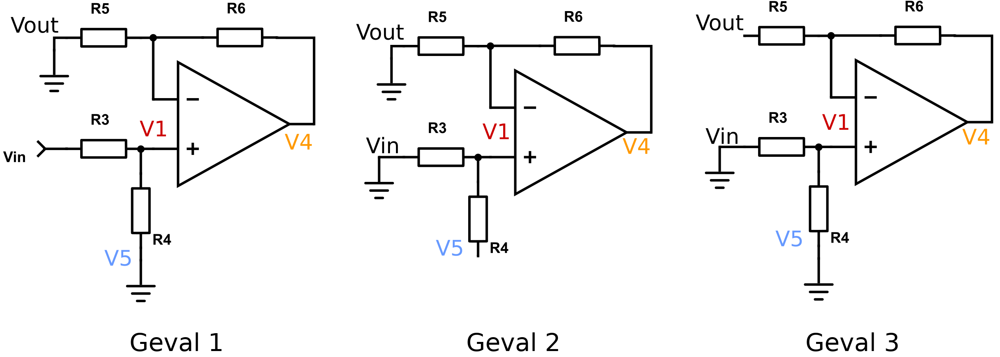
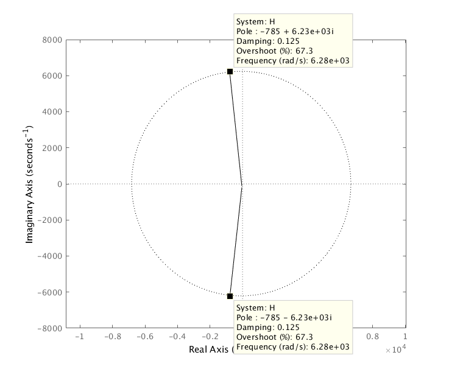

# Opdracht 2A: Analyse v.e. actieve filtertrap

## Specificatie

{height=150px}

+ **Low Pass KHN - Non Inverting** (schema nr 5)
+ Filter is een *LDL*
  + $|H(0)| = 6dB$
  + $|H(10 kHz)| = -34dB$
  + $Q_p = 4$

## Analyse

### DC & HF

Bij DC zijn condensatoren open kring, dus wordt de versterking bepaald door de feedback weerstanden $R_4$, $R_5$, en $R_6$. Dit is dus een vaste versterking. $|H(DC)| = A$.

Bij HF ($f=\infty$) zijn de condensatoren kortsluitingen, dus wordt het signaal volledig onderdrukt door het ontbreken van de feedback lussen $C_1$ en $C_2$. $|H(HF)| = -\infty dB$

{height=150px}

### Bepaal de transferfunctie

Ik heb de transfer functie uitgerekend door het schema op te splitsen in twee integrators en de eerste opamp.

#### De integrators

{height=100px}

De algemene formule voor een integrator is $v_o=\frac{-v_1}{sRC}$.

Voor deze twee specifieke gevallen: $v_5=\frac{-v_4}{sR_1C_1}$ en $v_{out} = \frac{-v_5}{sR_2C_2}$.

Gecombineerd: $v_{out}=\frac{v_4}{s^2R_1C_1R_2C_2}$ of $v_4 = s^2R_1R_2C_1C_2v_{out}$

#### Superpositie

{height=150px}

##### Geval 1: $v_{in}$, $v_{out} = v_5 = 0$

De opamp is nu een niet inverterende versterker.

$v_4 = v_1 \cdot (1+\frac{R_6}{R_5})$

$v_1 = v_{in} \cdot \frac{R_4}{R_3+R_4} \Rightarrow v_4 = v_{in} \cdot \frac{R_4}{R_3+R_4} \cdot (1+\frac{R_6}{R_5}) = v_{in} \cdot \frac{R_4}{R_3+R_4} \cdot \frac{R_6+R_5}{R_5}$

##### Geval 2: $v_5$, $v_{out} = v_{in} = 0$

De opamp is nu een niet inverterende versterker.

$v_4 = v_1 \cdot (1+\frac{R_6}{R_5})$

$v_1 = v_5 \cdot \frac{R_3}{R_3+R_4} \Rightarrow v_4 = v_5 \cdot \frac{R_3}{R_3+R_4} \cdot (1+\frac{R_6}{R_5}) = v_5 \cdot \frac{R_3}{R_3+R_4} \cdot \frac{R_6+R_5}{R_5}$

##### Geval 3: $v_{out}$, $v_5 = v_{in} = 0$

De opamp is nu een inverterende versterker.

$v_4 = \frac{-R_6}{R5} \cdot v_{out}$

#### Totaal

$v_4 = \sum{v_4} = v_{in} \cdot \frac{R_4}{R_3+R_4} \cdot \frac{R_6+R_5}{R_5} + v_5 \cdot \frac{R_3}{R_3+R_4} \cdot \frac{R_6+R_5}{R_5} + \frac{-R_6}{R5} \cdot v_{out}$

$v_{in} \cdot \frac{R_4}{R_3+R_4} \cdot \frac{R_6+R_5}{R_5} = -v_5 \cdot \frac{R_3}{R_3+R_4} \cdot \frac{R_6+R_5}{R_5} + \frac{R_6}{R5} \cdot v_{out} + v_4$

Vervang in deze formule $v_5$ en $v_4$ door de formules van de twee integrators:

$v_{in} \cdot \frac{R_4}{R_3+R_4} \cdot \frac{R_6+R_5}{R_5} = v_{out} \cdot (sR_2C_2 \cdot \frac{R_3}{R_3+R_4} \cdot \frac{R_6+R_5}{R_5} + \frac{R_6}{R5} + s^2R_1R_2C_1C_2v)$

$\frac{v_{in}}{v_{out}} \cdot \frac{R_4}{R_3+R_4} \cdot \frac{R_6+R_5}{R_5} = s^2R_1R_2C_1C_2 + sR_2C_2 \cdot \frac{R_3}{R_3+R_4} \cdot \frac{R_6+R_5}{R_5} + \frac{R_6}{R5}$

$\frac{v_{out}}{v_{in}} = \frac{R_4}{R_3+R_4} \cdot \frac{R_6+R_5}{R_5} \cdot \frac{1}{s^2R_1R_2C_1C_2 + sR_2C_2 \cdot \frac{R_3}{R_3+R_4} \cdot \frac{R_6+R_5}{R_5} + \frac{R_6}{R5}}$

$\frac{v_{out}}{v_{in}} = \frac{R_4}{R_3+R_4} \cdot \frac{R_6+R_5}{R_5} \cdot \frac{1}{\frac{R_6}{R5} \cdot (s^2 \cdot \frac{R_1R_2C_1C_2R_5}{R_6} + sR_2C_2 \cdot \frac{R_3}{R_3+R_4} \cdot \frac{R_6+R_5}{R_6} + 1)}$

**Het resultaat:**

$H(s) = \frac{v_{out}}{v_{in}} = \frac{R_4}{R_3+R_4} \cdot \frac{R_6+R_5}{R_6} \cdot \frac{1}{s^2 \cdot \frac{R_1R_2C_1C_2R_5}{R_6} + sR_2C_2 \cdot \frac{R_3}{R_3+R_4} \cdot \frac{R_6+R_5}{R_6} + 1}$

### Pole-zero plot

\begin{wrapfigure}[0]{r}{200pt}
\vspace{-50pt}
\centering
\begin{tikzpicture}
\begin{axis}[
title={(Schets) Pole-Zero Plot},
axis x line=center,
axis y line=center,
yticklabels={,,},
xticklabels={,,},
xlabel=$\Re$,
ylabel=$\Im$,
xmin=-6300,
xmax=6300,
ymin=-6300,
ymax=6300,
axis equal image,
height=200pt,
width=200pt,
]
\addplot[
only marks,
mark=x,
mark size=5pt,
] coordinates {(-785,-6234) (-785,+6234)};
\draw [dashed] (axis cs:0,0) circle [radius=6283];
\end{axis}
\end{tikzpicture}
\end{wrapfigure}

Geen zeros, wel polen, namelijk:

$\frac{s^2}{\omega_n^2} + \frac{s}{Q\omega_n} + 1 = 0$

$\frac{s^2}{(2000\pi)^2} + \frac{s}{4\cdot2000\pi} + 1 = 0$

$\frac{s^2}{(2000\pi)^2} + \frac{s}{8000\pi} + 1 = 0$

2 complexe polen:

$250\pi(-1+3\sqrt{7}i)$ en $250\pi(-1-3\sqrt{7}i)$

of ongeveer

$-785+6234i = 6283 \angle \ang{97}$ en $-785-6234i = 6283 \angle \ang{-97}$

### Frequentiegedrag

\begin{tikzpicture}
\begin{axis}[
width=\textwidth,
height=\axisdefaultheight,
title={Asymptotisch Bodediagram},
xlabel={Frequentie [Hz]},
ylabel={Versterking [dB]},
xmode=log,
ymajorgrids=true,
xmajorgrids=true, 
xminorgrids=true,
grid style=dashed,
xmin=100, xmax=10000,
ymin=-40, ymax=20,
ytick={0,6,-34},
]

\addplot
table {
100 6
1000 6
10000 -34
};
\node[color=blue] at (axis cs: 2000,-15) {$-40dB/dec$};
\node[color=blue,anchor=south] at (axis cs: 200,6) {$K = 2 = 6dB$};
\draw[thick,red,->] (axis cs: 1000,6) -- (axis cs: 1000,15);
\node[color=red,anchor=west] at (axis cs: 1000,10) {$Q = 4$};

\end{axis}
\end{tikzpicture}

De lijn van $-40dB/dec$, het beginpunt bij $10 kHz,-34dB$, en het filtertype (LDF) laat toe $f_n$ te berekenen. We moeten $40dB$ zakken van $6dB$ to $-34dB$, dit is dus 1 decade, ofwel $f_n = 1 kHz$.
Door de dubbele pool is er maar 1 knik in de grafiek, daar gaat de helling van $0$ naar $-40dB/dec$.

### Tijdsgedrag

\begin{tikzpicture}
\begin{axis}[
width=\textwidth,
height=\axisdefaultheight,
title={Step Response},
xlabel={Time [ms])},
ylabel={Amplitude [V]},
xlabel={t [ms]},
ylabel={A [V]},
ymajorgrids=true,
xmajorgrids=true, 
xminorgrids=true,
grid style=dashed,
xmin=0, xmax=7,
ymin=0, ymax=4,
]

\addplot[smooth, 
black,
thick,
mark=none,
domain=0:7,
samples=100]
{2*(1-(1/sqrt(1-0.125^2))*exp(-0.125*2*pi*x)*cos(deg(2*pi*sqrt(1-0.125^2)*x)))};

\addplot[smooth, 
red,
mark=none,
domain=0:7,
samples=100]
{2*(1-(1/sqrt(1-0.125^2))*exp(-0.125*2*pi*x))};
\addplot[smooth, 
red,
mark=none,
domain=0:7,
samples=100]
{2*(1+(1/sqrt(1-0.125^2))*exp(-0.125*2*pi*x))};

\end{axis}
\end{tikzpicture}

Het tijdsgedrag van een filter wordt bepaald door de transfer functie vanuit het $s$ domein om te zetten naar het $t$ domein met een inverse Laplace transformatie.

$H(t) = K(1-\frac{1}{\sqrt{1-\zeta^2}}e^{-\zeta\omega_0t} cos(\omega_0\sqrt{1-\zeta^2}t))$

met $K = 2$ en $\zeta = \frac{1}{2Q} = \frac{1}{2 \cdot 4} = 0.125$ en $\omega = 2 \pi \cdot f_n = 2000\pi$

$H(t) \approx 2-2e^{-250 \pi \cdot t} cos(2000 \pi \cdot t)$

Deze afronding is nauwkeurig genoeg om de functie te tekenen.

## Synthese

### Vergelijk transfer functie met de algemene vorm

Algemene vorm LDL filter: $H(s) = K\frac{1}{(\frac{s}{\omega_n})^2+\frac{1}{Q}\cdot(\frac{s}{\omega_n})+1}$

+ $K=\frac{R_4}{R_3+R_4} \cdot \frac{R_5+R_6}{R_6}$
+ $\frac{1}{\omega_n^2} = \frac{C_1C_2R_1R_2R_5}{R_6}$
+ $\frac{1}{Q\omega_n}=C_2R_2 \cdot \frac{R_3}{R_4+R_3} \cdot \frac{R_5+R_6}{R_6}$

### Ontwerpvergelijkingen

Kies:

+ $C_2 = c^{te} = 1$
+ $R = R_1 = R_2 = R_3 = R_4 = R_6$

Motiverting:

+ $C_2 = 1$ omdat van $C_1$ makkelijker een ontwerpvergelijking te vinden is.
+ $R_5$ variabel omdat die enkel in tellers zit. Dit maakt ontwerpvergelijkingen makkelijker.

De transfer functie wordt dan:

$H(s) = \frac{R+R_5}{2R} \cdot \frac{1}{s^2RC_1C_2R_5 +  s \cdot (R+R_5) \cdot \frac{C_2}{2} + 1}$

Met de vergelijkingen van uit de transfer functie:

+ $K=\frac{R_4}{R_3+R_4} \cdot \frac{R_5+R_6}{R_6}$
+ $\frac{1}{\omega_n^2} = \frac{C_1C_2R_1R_2R_5}{R_6}$
+ $\frac{1}{Q\omega_n}=C_2R_2 \cdot \frac{R_3}{R_4+R_3} \cdot \frac{R_5+R_6}{R_6}$

Geeft:

+ $K = \frac{R}{2R} \cdot \frac{R_5+R}{R} = \frac{R_5+R}{2R} \Rightarrow R_5 + R = 2KR \Rightarrow R_5 = R(2K-1)$
+ $\frac{1}{\omega_n^2} = \frac{C_1C_2R^2R_5}{R} = C_1C_2RR_5 \Rightarrow C_1 = \frac{1}{\omega_n^2C_2R_5R}$
+ $\frac{1}{Q\omega_n}=C_2R_2 \cdot \frac{R_3}{R_4+R_3} \cdot \frac{R_5+R_6}{R_6} = C_2R \cdot \frac{R}{2R} \cdot \frac{R_5+R}{R} = \frac{C_2(R_5+R)}{2} \Rightarrow Q = \frac{2}{\omega_nC_22KR} \Rightarrow R = \frac{1}{Q\omega_nC_2K}$

De ontwerpvergelijkingen:

+ $R = \frac{1}{Q\omega_nC_2K}$
+ $R_5 = R(2K-1)$
+ $C_1 = \frac{1}{\omega_n^2C_2R_5R}$

#### Impedantieschaling

Waarden zonder impedantieschaling:

+ $R = 0.0000198943...\Omega$
+ $R_5 = 0.0000596831...\Omega$
+ $C_1 = 21.33...F$
+ $C_2 = 1F$

Met schalingsfactor $10^9$:

+ $R=R*ISF = 19894.36... = 19.89 k\Omega$
+ $R_5 = R_5 * ISF = 59683.10... = 59.68 k\Omega$
+ $C_1 = \frac{C_1}{ISF} = 0.000000021333... = 21.33 nF$
+ $C_2 = \frac{C_2}{ISF} = 0.000000001 = 1nF$

## Simulatie op basis van de transferfunctie (Matlab)

\lstinputlisting[language=Matlab]{ActieveFiltertrap.m}

### Pole Zero plot

{height=350px}

### Bode plot

{height=450px}

Door de dubbele pool is er maar 1 knik in de (anymptotosche) grafiek, daar gaat de helling van $0$ naar $-40dB/dec$.

### Stapresponsie

{height=250px}

## Simulatie op basis van de componenten (SPICE)

De numering van de nodes is niet systematish. Ze zijn aangeduid op het schema uit de opgave in lichtgrijs.

### Ideaal

\lstinputlisting{spice.cir}

{height=250px}

#### VCVS

Netlist vrijwel identiek aan het ideaal geval, enkel het opamp model is aangepast.

{height=250px}

#### tl084

Netlist vrijwel identiek aan het ideaal geval, het opamp model is aangepast en extra voeding ($\pm15V$) toegevoegd voor de opamps.

{height=250px}

#### Monte Carlo analyse R5% - C20%

Bij een Monte Carlo analyse worden de weerstanden en condensatoren vervangen door een model dat rekening houd met de toleranties van de componenten.

{height=350px}

Hier is duidelijk op te zien dat de kantelfrequentie een stukje kan verschuiven, ongeveer $100Hz$ naar beneden en $300Hz$ naar boven.

#### Monte Carlo analyse 1%

Code bijna gelijk aan de vorige, alleen 1% i.p.v. 5% en 20%.

{height=350px}

Hier is duidelijk veel minder verschil. M.a.w. als de filter nauwkeurig moet zijn, is investeren in 1% componenten geen slecht idee.

### Ingangsimpedantie

{height=200px}

Omdat er $\ang{180}$ fasedraaing zit op de ingangsstroom is de reele as (links) negatief en lijkt deze ondersteboven te staan. De reele impedantiecomonent *daalt* rond de kantelfrequentie. De maximale ingangsimpedantie is $40k\Omega$, de minimale $20k\Omega$.

{height=200px}

### Staprespontie

{height=200px}

De staprespontie berekend via SPICE is vrijwel identiek aan die berekend via Matlab.