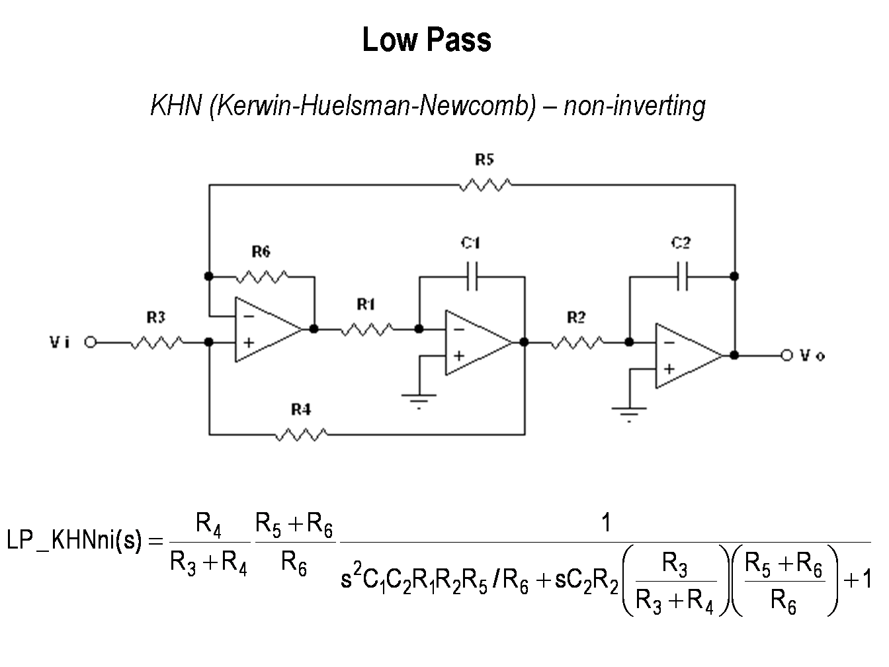
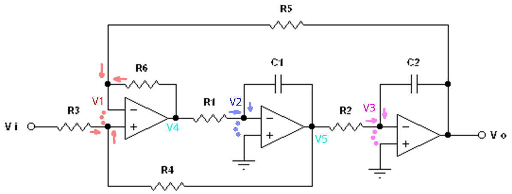

# Opdracht A2: Actieve filtertrap

## Specificatie

**Low Pass KHN (Kerwin-Heulsman-Newcomb) - Non Inverting**

$|H(0)| = 6 dB $
$|H(1 kHz)| = -34 dB$
$Q_p = 4$

## Knooppunten

### Vergelijkingen

1.  $\frac{V_i-V_1}{R_3}+\frac{V_5-V_1}{R_4}=0$
2. $\frac{V_0-V_1}{R_5}+\frac{V_4-V_1}{R_6}=0$
3. $\frac{V_4-V_2}{R_1}+V_5\cdot sC_1 = 0​$ met $V_2 = 0​$ dus $\frac{V_4}{R_1}+V_5\cdot sC_1 = 0​$
4. $\frac{V_5-V_3}{R_2}+V_o\cdot sC_2 = 0$met $V_3 = 0$ dus $\frac{V_5}{R_2}+V_o\cdot sC_2 = 0$

**Magic**

$$LP\_KHNni(s) = \frac{R_4}{R_3+R_4} \cdot \frac{R_5+R_6}{R_6}\cdot\frac{1}{\frac{s^2C_1C_2R_1R_2R_5}{R_6}+sC_2R_2\cdot\frac{R_3}{R_3+R_4}\cdot\frac{R_5+R_6}{R_6}+1}$$

Algemene vorm LDF: $H(\omega) = K\frac{1}{(\frac{s}{\omega_n})^2+\frac{1}{Q_p}\cdot(\frac{s}{\omega_n})+1}$

### Analyse (FOUT) Zie papier

- $f_n = 1kHz$ dus $\omega_n = 2\pi\cdot1000 = 2000\pi$
- $K = 6dB = 2 = \frac{R_4}{R_3+R_4} \cdot \frac{R_5+R_6}{R_6}$
- $(\frac{1}{\omega_n})^2 = \frac{C_1C_2R_1R_2R_5}{R_6}$ dus $\omega_n = \sqrt{\frac{R_6}{C_1C_2R_1R_2R_5}}$
- $R_3=R_4$ & $R_5=3R_6$
- $\omega_n=\frac{1}{\sqrt{3C_1C_2R_1R_2}} = 2000\pi$
- $C_2R_2=\frac{1}{16000\pi}$
- $C_1R_1=\frac{1}{3000\pi}$

### Matlab

